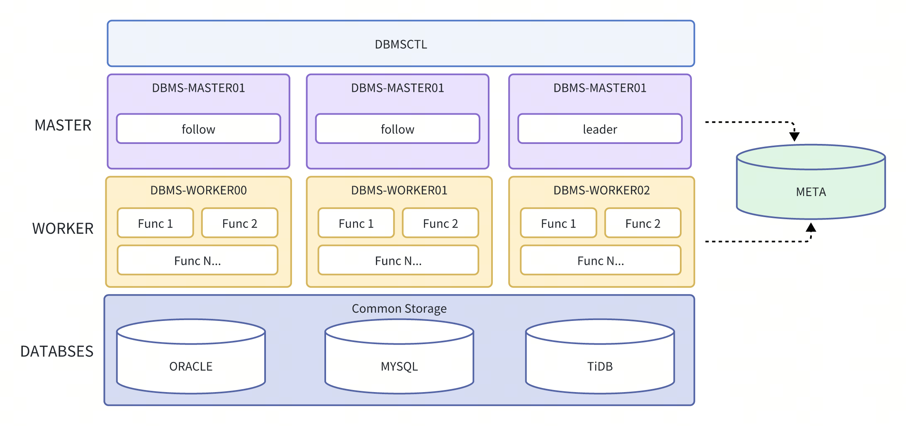

<h1 align="center">
  DBMS
</h1>

<p align="center">
数据库分布式迁移服务平台
</p>

<div align="center">

  [](https://github.com/wentaojin/dbms/actions)
  
  
  [](https://github.com/wentaojin/dbms/blob/main/LICENSE)
  
  [](https://github.com/wentaojin/dbms/releases)
  
  [](https://github.com/wentaojin/dbms/issues) 
</div>

-------
<p align="center">
    <a href="#whats-included-">What's included 🚀</a> &bull;
    <a href="#architecture-">Architecture 🌈</a> &bull;
    <a href="#quick-start-">Quick Start 🛠️</a> &bull;
    <a href="#development-">Development 🧬</a> &bull;
    <a href="#customization-">Customization 🖍️</a> &bull;
    <a href="#license-">License 📓</a> &bull;
    <a href="#acknowledgments-">Acknowledgments ⛳</a>
</p>

-------
### What's included 🚀

- ORACLE -> MYSQL 兼容性数据库迁移服务
  - Schema 表结构转换，支持 schema、表、列级别和默认值自定义
  - Schema 表结构比较，支持 schema、表、列级别和默认值自定义
  - Schema 表数据迁移，支持 sql、csv 一致性或非一致性迁移以及自定义 sql 语句迁移
    - TiDB 数据库 csv 数据迁移支持自动导入（Require: TiDB Version >= v7.5）
  - Schema 表数据校验，支持 schema、表、列级别路由规则以及自定义筛选过滤字段
    - TiDB 数据库支持自定义配置上下游快照数据校验
  - Schema 表对象信息评估，支持输出类 AWR 报告
  - Schema NUMBER 数据类型列采样或全扫描，识别 NUMBER 数据类型适配建议
- Postgres -> MYSQL 兼容性数据库迁移服务
  - Schema 表结构转换，支持 schema、表、列级别和默认值自定义
  - Schema 表数据迁移，支持 sql、csv 一致性或非一致性迁移
      - TiDB 数据库 csv 数据迁移支持自动导入（Require: TiDB Version >= v7.5）
- TiDB -> ORACLE 兼容性数据库迁移服务
  - Schema 表数据校验，支持 schema、表、列级别路由规则、配置上下游快照数据校验以及自定义筛选过滤字段
- ...

**未来计划**
- POSTGRESQL 数据库与 MYSQL 兼容性数据库数据校验
- MYSQL 兼容性数据库表结构迁移至 ORACLE 数据库
- MYSQL 兼容性数据库表结构与 ORACLE 数据库表结构对比
- ORACLE 数据实时同步到 MYSQL 兼容性数据库（基于 logminer）

------
### Architecture 🌈



DBMS 数据库分布式迁移服务平台由 dbms-master、dbms-worker、dbms-ctl、dbms-cluster 四个组件组成，主要功能：
- dbms-master：实例注册、服务发现、健康检查、api访问（仅leader）
- dbms-worker：任务运行者
- dbms-ctl：与 master leader 节点交互进行提交任务
- dbms-cluster：提供集群部署安装、扩容收缩、启动、停止、重启等集群管理操作

------
### Quick Start 🛠️

[DBMS 使用手册指引](doc/quick_start.md)

[DBMS 集群运维管理](doc/dbms_operation.md)

[DBMS 数据源权限要求](doc/dbms_permissions.md)

[ORACLE 迁移服务手册](doc/oracle_migrate_manual.md)

-------
### Development 🧬
当功能开发或 BUG 修复完成后，可按照如下方式本地快速启动集群进行验证和测试。

**启动集群**
```shell
$ make runMaster
$ make runWorker
```
**验证测试**

dbms-ctl 命令 help，通过子命令进行任务提交验证测试
```shell
$ dbms-ctl --help
CLI dbmsctl app for dbms cluster

Usage:
  dbmsctl [flags]
  dbmsctl [command]

Available Commands:
  assess      Operator cluster data assess
  compare     Operator cluster data compare
  completion  Generate the autocompletion script for the specified shell
  csv         Operator cluster csv migrate
  database    Operator cluster database
  datasource  Operator cluster datasource
  decrypt     Operator cluster decrypt data
  help        Help about any command
  sql         Operator cluster sql migrate
  stmt        Operator cluster statement migrate
  struct      Operator cluster struct migrate
  task        Operator cluster task
  verify      Operator cluster data compare

Flags:
  -h, --help            help for dbmsctl
  -s, --server string   server addr for app server
  -v, --version         version for app client

Use "dbmsctl [command] --help" for more information about a command.
```

-------
### Customization 🖍️
If you like the project and want to buy me a cola or have tech exchange, you can button sponsor or join tech group:

| QQ Group                                      |
|-----------------------------------------------|
|  |


-------
### License 📓

This software is free to use under the Apache License.
